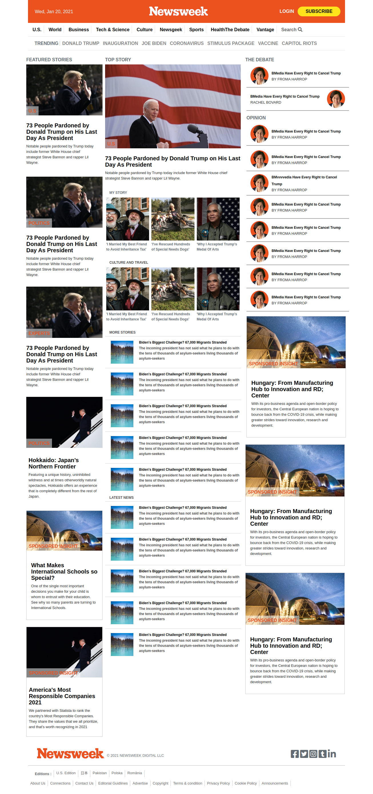
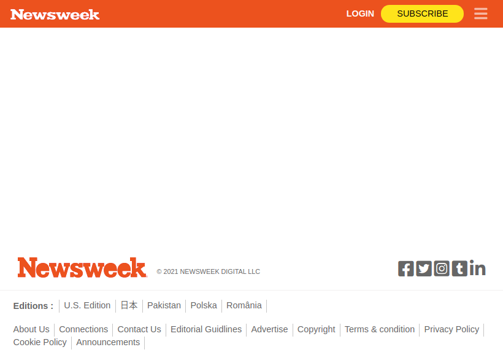
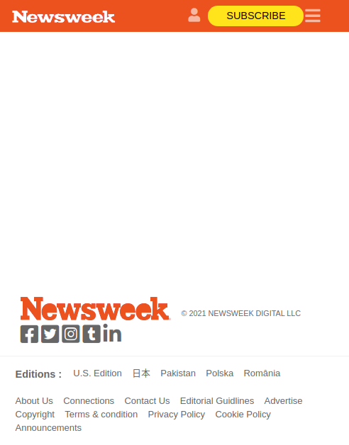

# Newsweek Milestone 1

> Building Newsweek's page clone using CSS framework (Bootstrap) and media quesries

## Built With

- HTML, CSS
- Bootstrap

## Live Demo

[Live Demo Link](https://tanzila-abedin.github.io/newsweek/)

## Getting Started

**This is an example of how you may give instructions on setting up your project locally.**
**Modify this file to match your project, remove sections that don't apply. For example: delete the testing section if the currect project doesn't require testing.**

To get a local copy up and running follow these simple example steps.

### Prerequisites

### Setup

### Install

### Usage

### Run tests

### Deployment

## Authors

👤 **Author1** Tanzila

- GitHub: [@tanzila-ebedines](https://github.com/githubhandle)
- LinkedIn: [LinkedIn](https://linkedin.com/linkedinhandle)

👤 **Author2** Shoira

- GitHub: [@shoirata](https://github.com/githubhandle)
- LinkedIn: [LinkedIn](https://linkedin.com/linkedinhandle)

## 🤝 Contributing

Contributions, issues, and feature requests are welcome!

Feel free to check the [issues page](issues/).

## Show your support

Give a ⭐️ if you like this project!

## Acknowledgments

- Hat tip to anyone whose code was used
- Inspiration
- etc

## 📝 License

This project is [MIT](lic.url) licensed.
